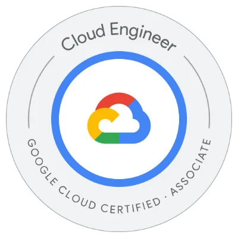
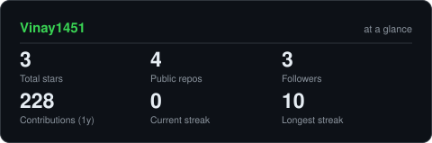

<div align="center">

<!-- ═══════════════════════════════════════════════════════════════════ -->
<!--                        HEADER BANNER                               -->
<!-- ═══════════════════════════════════════════════════════════════════ -->



<br>

<!-- ANIMATED TYPING -->
<a href="https://github.com/Vinay1451">
  
</a>

<br>

<!-- SOCIAL BADGES -->
<a href="https://linkedin.com/in/vinay-evolvecode/"></a>&nbsp;
<a href="mailto:vinaykumar1122t@gmail.com"></a>&nbsp;
<a href="https://github.com/Vinay1451"></a>&nbsp;


</div>


<!-- ═══════════════════════════════════════════════════════════════════ -->
<!--                            ABOUT ME                                -->
<!-- ═══════════════════════════════════════════════════════════════════ -->

<div align="center">

## About Me

```console
vinay@cloud:~$ whoami
```

</div>

I am **Vinay Kumar** (Avulakunta Vinay Kumar), a **Cloud & DevOps Engineer** with hands-on experience building, containerizing, and deploying production applications using **AWS**, **Microsoft Azure**, **Docker**, **Linux**, **Python**, and **Git**, with foundational knowledge of **CI/CD** automation and **AI-assisted engineering**.

- **Cloud Engineering** — Hands-on architecture design with AWS (EC2, S3, IAM, VPC, RDS, CloudWatch, ECR, App Runner) and Microsoft Azure.
- **DevOps & Containers** — Building automated CI/CD pipelines with GitHub Actions, containerizing workloads with Docker, and managing Linux infrastructure.
- **Industry Experience** — Former **Microsoft Azure – AI Intern** at Edunet Foundation & AICTE, building event-driven data processing workflows.
- **Recognition** — Selected for the **Google Cloud Career Launchpad (APAC 2025)**.

<br>


<!-- ═══════════════════════════════════════════════════════════════════ -->
<!--                       EXPERIENCE                                   -->
<!-- ═══════════════════════════════════════════════════════════════════ -->

<div align="center">

## Professional Experience

</div>

### Microsoft Azure – AI Intern
**Edunet Foundation & AICTE** · *May 2025 – Jun 2025 (Remote)*

- Gained foundational knowledge of Microsoft Azure and hands-on exposure to Azure Blob Storage, Azure Functions, Event Grid, and Azure Pipelines.
- Built Python data workflows integrated with Azure Blob Storage to process and analyze 1,000+ records across cloud workflows.
- Implemented event-driven serverless architectures with Azure Functions and Event Grid to automate deployment and ingestion pipelines.

<br>


<!-- ═══════════════════════════════════════════════════════════════════ -->
<!--                       CERTIFICATIONS                               -->
<!-- ═══════════════════════════════════════════════════════════════════ -->

<div align="center">

## Certifications & Honors

<table>
<tr>
<td align="center" width="280">


<br><br>
<strong>Microsoft Certified</strong><br>
Azure Administrator Associate<br>
<sub>Certified</sub>

</td>
<td align="center" width="280">


<br><br>
<strong>Anthropic Claude</strong><br>
Certified Associate – Architect Foundations<br>
<sub>Certified</sub>

</td>
<td align="center" width="280">


<br><br>
<strong>Google Cloud</strong><br>
Career Launchpad – APAC 2025<br>
<sub>Selected Participant</sub>

</td>
</tr>
</table>

</div>


<!-- ═══════════════════════════════════════════════════════════════════ -->
<!--                      TECHNICAL SKILLS                              -->
<!-- ═══════════════════════════════════════════════════════════════════ -->

<div align="center">

## Technical Skills & Stack

<br>

| Domain | Technologies & Competencies |
|---|---|
| **Cloud Platforms** | `AWS (EC2, S3, IAM, VPC, RDS, CloudWatch, ECR, App Runner)` `Microsoft Azure (Functions, Blob, Event Grid)` `GCP` |
| **DevOps & Containers** | `Docker` `Git` `GitHub Actions` `CI/CD Pipelines` `Sentry Monitoring` |
| **Programming & Systems** | `Python` `Linux Administration` `Bash / Shell Scripting` |
| **Networking & Security** | `TCP/IP` `DNS` `HTTP/HTTPS` `Ports & Routing` `Security Groups` `VPC Subnets (Public/Private)` |
| **AI-Assisted Development** | `Anthropic Claude` `GenAI Coding & Debugging Workflows` |

<br>


</div>


<!-- ═══════════════════════════════════════════════════════════════════ -->
<!--                       SKILL RADARS                                 -->
<!-- ═══════════════════════════════════════════════════════════════════ -->

<div align="center">

## Core Competencies & Language Distribution

<table>
<tr>
<td width="50%" align="center" valign="middle">

<!-- Self-rated radar matching resume skills -->
<picture>
  <source media="(prefers-color-scheme: dark)"  srcset="assets/radar-dark.svg">
  <source media="(prefers-color-scheme: light)" srcset="assets/radar-light.svg">
  
</picture>

</td>
<td width="50%" align="center" valign="middle">

<!-- Live language radar built from real language byte counts -->
<picture>
  <source media="(prefers-color-scheme: dark)"  srcset="assets/radar-langs-dark.svg">
  <source media="(prefers-color-scheme: light)" srcset="assets/radar-langs-light.svg">
  
</picture>

</td>
</tr>
</table>

</div>


<!-- ═══════════════════════════════════════════════════════════════════ -->
<!--                     FEATURED PROJECTS                              -->
<!-- ═══════════════════════════════════════════════════════════════════ -->

<div align="center">

## Featured Engineering Projects

</div>

### 1. Adaptive AI – Personalized Learning Platform (2026)
*Next.js · AWS RDS · Docker · AWS ECR · AWS App Runner · GitHub Actions · Sentry*
- Set up AWS ECR and AWS App Runner for automated, containerized application deployment.
- Containerized application microservices with Docker and managed image registries via Amazon ECR.
- Built automated GitHub Actions CI/CD workflows for testing and deployment, integrated with Sentry for real-time error tracking and performance monitoring.

---

### 2. LogPulse – Application Log Analyzer (2026)
*Python · Regex · Log Parsing · Claude AI · Data Visualization*
- Engineered a high-throughput Python log parsing engine classifying records by severity: `INFO`, `WARNING`, `ERROR`, and `CRITICAL`.
- Integrated Anthropic Claude AI to generate plain-language root-cause summaries for high-frequency errors, accelerating incident resolution.
- Generated visual trends of error frequency patterns to proactively identify recurring application failures.

---

### 3. Two-Tier Web Application Deployment on AWS (2025)
*AWS EC2 · Docker · Amazon VPC · Security Groups · RDS · Linux*
- Architected and deployed an enterprise two-tier web application environment utilizing Amazon EC2 and Amazon RDS.
- Containerized workloads using Docker and deployed on hardened Linux EC2 instances.
- Configured Amazon VPC network architecture featuring public/private subnets, custom route tables, NAT, DNS resolution, and strict security group policies.

<br>


<!-- ═══════════════════════════════════════════════════════════════════ -->
<!--                    GITHUB STATS & ACTIVITY                         -->
<!-- ═══════════════════════════════════════════════════════════════════ -->

<div align="center">

## GitHub Activity & Overview

<!-- Self-hosted stat card -->
<picture>
  <source media="(prefers-color-scheme: dark)"  srcset="assets/card-stats-dark.svg">
  <source media="(prefers-color-scheme: light)" srcset="assets/card-stats-light.svg">
  
</picture>

<br><br>

<!-- 3D Isometric Calendar -->


</div>


<!-- ═══════════════════════════════════════════════════════════════════ -->
<!--                         CURRENT FOCUS                              -->
<!-- ═══════════════════════════════════════════════════════════════════ -->

<div align="center">

## Current Focus

</div>

```yaml
Role:         Cloud & DevOps Engineer
Location:     Annamayya, Andhra Pradesh, India
Focus:        AWS Cloud Infrastructure, Docker Containerization & CI/CD Pipelines
Core Stack:   AWS, Azure, Docker, Linux, Python, GitHub Actions
Projects:     Adaptive AI, LogPulse, Multi-Tier AWS Deployments
Contact:      vinaykumar1122t@gmail.com
```


<!-- ═══════════════════════════════════════════════════════════════════ -->
<!--                        CONNECT                                     -->
<!-- ═══════════════════════════════════════════════════════════════════ -->

<div align="center">

## Contact & Connect

<a href="https://linkedin.com/in/vinay-evolvecode/"></a>&nbsp;
<a href="mailto:vinaykumar1122t@gmail.com"></a>&nbsp;
<a href="https://github.com/Vinay1451"></a>

<br><br>


<sub>Built with precision · Automated with passion · Deployed with confidence</sub>

</div>
