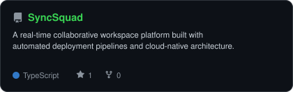
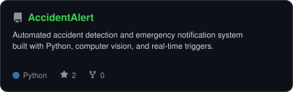
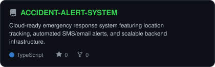

<div align="center">

<!-- ═══════════════════════════════════════════════════════════════════ -->
<!--                        HEADER BANNER                               -->
<!-- ═══════════════════════════════════════════════════════════════════ -->


<br>

<!-- ANIMATED TYPING -->
<a href="https://github.com/Vinay1451">
  
</a>

<br>

<!-- SOCIAL BADGES -->
<a href="https://linkedin.com/in/vinay-evolvecode/"></a>&nbsp;
<a href="mailto:vinaykumar1122t@gmail.com"></a>&nbsp;


</div>


<!-- ═══════════════════════════════════════════════════════════════════ -->
<!--                          ABOUT ME                                  -->
<!-- ═══════════════════════════════════════════════════════════════════ -->

##  &nbsp;About Me

```console
vinay@cloud:~$ cat about.txt
```

Hi, I'm **Avulakunta Vinay Kumar** — a **Cloud & DevOps Engineer** passionate about building reliable, scalable, and automated cloud infrastructure.

🔹 **Cloud Infrastructure** — Building hands-on cloud environments with AWS (EC2, S3, IAM, VPC, Lambda, Serverless)

🔹 **DevOps & Automation** — Automating workflows using CI/CD pipelines, Docker containers, Linux, and Bash scripting

🔹 **Systems Engineering** — Deepening expertise in Linux administration, system fundamentals, and network architecture

🔹 **Engineering Goal** — Building systems that are not only functional, but automated, observable, scalable, and reliable


<!-- ═══════════════════════════════════════════════════════════════════ -->
<!--                       CERTIFICATIONS                               -->
<!-- ═══════════════════════════════════════════════════════════════════ -->

<div align="center">

## 🏅 Certifications

<a href="https://cloud.google.com/learn/certification/cloud-engineer">
  
</a>

<br><br>

<table>
<tr>
<td align="center" width="250">

**Google Cloud**<br>
Associate Cloud Engineer<br>
<sub>☁️ Certified 2026</sub>

</td>
</tr>
</table>

</div>


<!-- ═══════════════════════════════════════════════════════════════════ -->
<!--                      TECH STACK                                    -->
<!-- ═══════════════════════════════════════════════════════════════════ -->

<div align="center">

## 🛠️ Tech Stack & Capabilities

<br>

| Domain | Technologies & Tools |
|---|---|
| **Cloud & Infrastructure** | `AWS (EC2, S3, IAM, VPC, Lambda)` `GCP` `Cloud Native` |
| **DevOps & CI/CD** | `Docker` `Git` `GitHub Actions` `Linux / Bash` `CI/CD Pipelines` |
| **Scripting & Automation** | `Python` `Bash / Shell Scripting` `Automation Scripts` |
| **Databases & Storage** | `PostgreSQL` `Supabase` `Firebase` `Cloud Storage` |
| **Developer Tools** | `VSCode` `Linux CLI` `Vercel` `GitHub` |

<br>


</div>


<!-- ═══════════════════════════════════════════════════════════════════ -->
<!--                       SKILL RADARS                                 -->
<!-- ═══════════════════════════════════════════════════════════════════ -->

<div align="center">

## 📊 Skill & Language Radars

<table>
<tr>
<td width="50%" align="center" valign="middle">

<!-- Self-rated radar -->
<picture>
  <source media="(prefers-color-scheme: dark)"  srcset="assets/radar-dark.svg">
  <source media="(prefers-color-scheme: light)" srcset="assets/radar-light.svg">
  
</picture>

</td>
<td width="50%" align="center" valign="middle">

<!-- Live language radar built from real language byte counts -->
<picture>
  <source media="(prefers-color-scheme: dark)"  srcset="assets/radar-langs-dark.svg">
  <source media="(prefers-color-scheme: light)" srcset="assets/radar-langs-light.svg">
  
</picture>

</td>
</tr>
</table>

</div>


<!-- ═══════════════════════════════════════════════════════════════════ -->
<!--                     FEATURED PROJECTS                              -->
<!-- ═══════════════════════════════════════════════════════════════════ -->

<div align="center">

## 🚀 Featured Projects

<table>
<tr>
<td width="50%" align="center">

<a href="https://github.com/Vinay1451/SyncSquad">
<picture>
  <source media="(prefers-color-scheme: dark)"  srcset="assets/card-SyncSquad-dark.svg">
  <source media="(prefers-color-scheme: light)" srcset="assets/card-SyncSquad-light.svg">
  
</picture>
</a>

</td>
<td width="50%" align="center">

<a href="https://github.com/Vinay1451/AccidentAlert">
<picture>
  <source media="(prefers-color-scheme: dark)"  srcset="assets/card-AccidentAlert-dark.svg">
  <source media="(prefers-color-scheme: light)" srcset="assets/card-AccidentAlert-light.svg">
  
</picture>
</a>

</td>
</tr>
<tr>
<td colspan="2" align="center">

<a href="https://github.com/Vinay1451/ACCIDENT-ALERT-SYSTEM">
<picture>
  <source media="(prefers-color-scheme: dark)"  srcset="assets/card-ACCIDENT-ALERT-SYSTEM-dark.svg">
  <source media="(prefers-color-scheme: light)" srcset="assets/card-ACCIDENT-ALERT-SYSTEM-light.svg">
  
</picture>
</a>

</td>
</tr>
</table>

</div>


<!-- ═══════════════════════════════════════════════════════════════════ -->
<!--                    GITHUB STATS & ACTIVITY                         -->
<!-- ═══════════════════════════════════════════════════════════════════ -->

<div align="center">

## 📈 GitHub Stats & Activity

<!-- Self-hosted stat card (always loads) + Streak Stats -->
<table>
<tr>
<td width="50%" align="center">

<picture>
  <source media="(prefers-color-scheme: dark)"  srcset="assets/card-stats-dark.svg">
  <source media="(prefers-color-scheme: light)" srcset="assets/card-stats-light.svg">
  
</picture>

</td>
<td width="50%" align="center">

<a href="https://github.com/Vinay1451">
  
</a>

</td>
</tr>
</table>

<br>

<!-- Dynamic stats + top languages (from github-readme-stats — may occasionally rate-limit) -->
<a href="https://github.com/Vinay1451">
  
</a>
<a href="https://github.com/Vinay1451">
  
</a>

<br><br>

<!-- Activity Graph -->
<a href="https://github.com/Vinay1451">
  
</a>

<br><br>

<!-- 3D Isometric Calendar -->


</div>


<!-- ═══════════════════════════════════════════════════════════════════ -->
<!--                        CONNECT                                     -->
<!-- ═══════════════════════════════════════════════════════════════════ -->

<div align="center">

## 🤝 Let's Connect

<a href="https://linkedin.com/in/vinay-evolvecode/"></a>&nbsp;
<a href="mailto:vinaykumar1122t@gmail.com"></a>&nbsp;
<a href="https://github.com/Vinay1451"></a>

<br><br>


<sub>⚡ Built with precision · Automated with passion · Deployed with confidence</sub>

</div>
